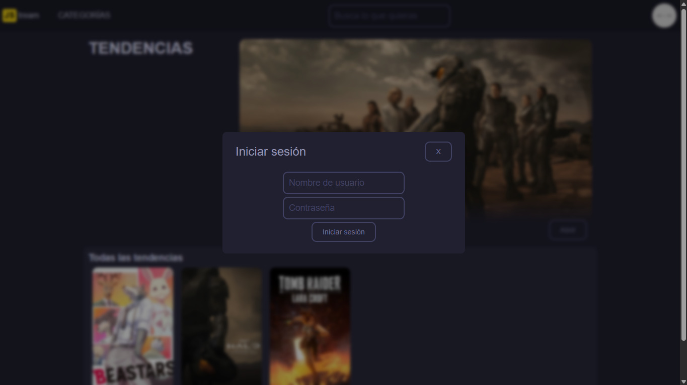
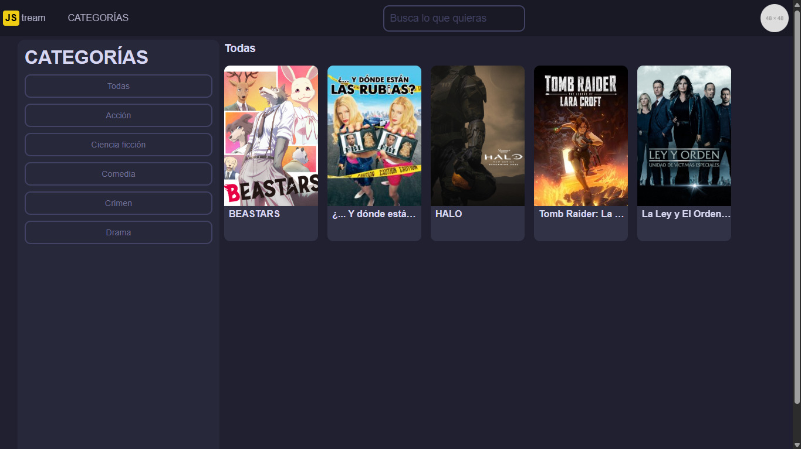
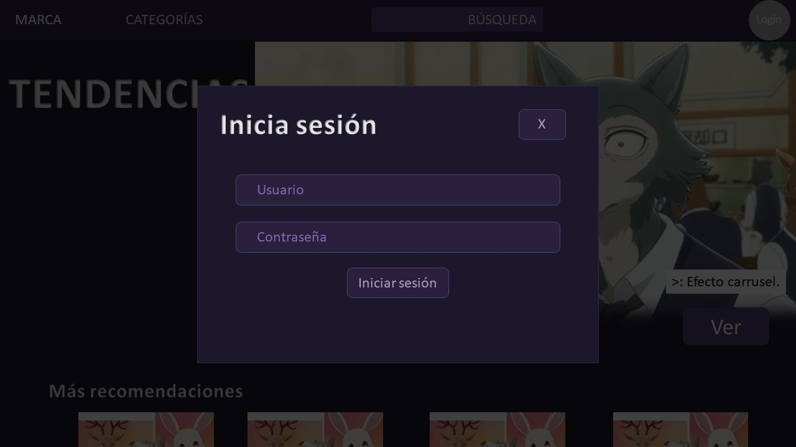
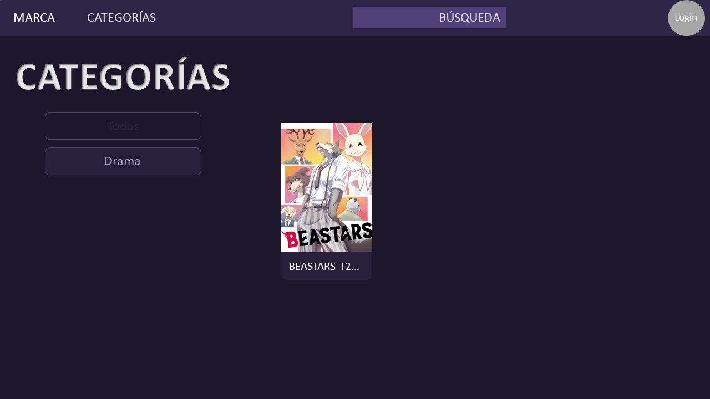
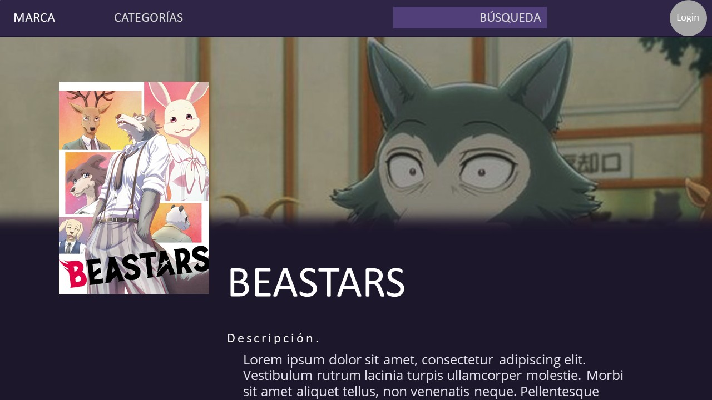

# JStream

JStream es una plataforma web de trasmisión de contenido audiovisual. Es un proyecto en desarrollo en conjunto con el programa del Semillero de desarrolladores MEGA.

## Imágenes del sistema en funcionamiento.
;
;
;
;

## Imágenes del diseño inicial.
;
;
;
;
;

## ¿Cómo ejecutar el programa.
Deberás ejecutarlo en un entorno de desarollo. No puedes solo abrir el archivo "index.html" porque CORS bloqueará los scripts y no se ejecutarán (la página se quedará esperando). A continuación, te explico cómo hacerlo funcionar paso a paso en un entorno con Windows 10/11 (estos pasos podrían ser diferentes en otros SOs):
1. **Descarga el repositorio.** Haz clic en el obvio botón verde "<> Code" y, luego, haz clic en "Download ZIP". Esto iniciará (o solicitará, depende de tu navegador) la descarga.
2. **Descomprime el repositorio.** Dirígete a tu carpeta de descargas (o donde sea que lo hayas guardado) y descomprime el archivo. Puedes utilizar la herramienta integrada de Windows para descomprimir archivos ZIP o cualquier otra de tu agrado.
3. **Descarga Visual Studio Code:**_Si ya tienes Visual Studio Code instalado, salta al siguiente paso_. [Haz clic aquí](https://code.visualstudio.com/) para descargar Visual Studio Code. Una vez descargado, lo instalas.
4. **Descarga la extensión Live Server:** _Si ya tienes esta extensión, salta al siguiente paso._ [Haz clic aquí](https://marketplace.visualstudio.com/items?itemName=ritwickdey.LiveServer) para descargar la extensión.
5. **Abre el repositorio en Visual Studio Code:** Abre Visual Studio Code y, en la parte superior izquierda, haz clic en _Archivo > Abrir carpeta_. Luego, busca la carpeta que descomprimiste en el paso 2 y ábrela (asegúrate que sea la carpeta más directa al repositorio, es decir, la carpeta en donde se encuentra el archivo "index.html"). Esto debería mostrar el repositorio en Visual Studio Code.
6. **Ejecuta el programa:** En la barra lateral izquierda, haz clic en la primera opción (Explorador) y busca el archivo "index.html". Ya que lo hayas encontrado, haz clic derecho sobre él y, finalmente, haz clic en "Open with Live Server". Si todo ha salido bien, ¡Enhorabuena!, haz conseguido ejecutar el programa.

## ¿Cómo lo hice?

## Problemas conocidos.
1. La barra de búsqueda ubicada en la barra superior no tiene funcionalidad. Se mantuvo allí para mantener la estética de la barra superior.
2. La gestión de Componentes Emergentes (popups y pantallas de carga, CE de aquí en adelante) podría romperse en actualizaciones futuras debido a cómo se controlan. Cuando un CE aparece, otros elementos del DOM son deshabilitados (atributo "inert"). De igual forma, cuando son cerrados, estos elementos de activan nuevamente. El manejo de múltiples CE necesita un control jerárquico, ya que la aparición de un nuevo CE puede desactivar otros CE y la desaparición de un CE puede reactivar la página entera (este último es un comportamiento no deseado).
3. Si bien la sesión es simulada, la sesión se "cerrará" al actualizar la página justo después de haber inciado sesión.

## Retrospectiva
### ¿Qué hice bien?
No quería que la característica de iniciar sesión se realizara en una página diferente, así que decidí hacerlo a través de un popup que aparece en cualquier ubicación. Además, el Efecto Carrusel que conseguí hacer en la página principal me ha dejado muy satisfecho.

### ¿Qué no salió bien?
Repetí bloques de código. Este sprint cambia entre páginas y tiene que recargar los scripts pertinentes. Como no todas las páginas cargan las mismas cosas ni usan exactamente el mismo código, separé los scripts y coloqué los mismos bloques de código que, sí o sí, todas las páginas necesitan.

### ¿Qué puedo hacer diferente?
Definitivamente lo de la repetición de bloques de código; hacer el código lo menos redundante y repetitivo posible. Estoy seguro de que esto podría mejorarlo con Angular a pesar de jamás haberlo usado nunca. Sería maravilloso poder utilizar ReactJS en su lugar, pero no es una opción ni una tecnología requerida.