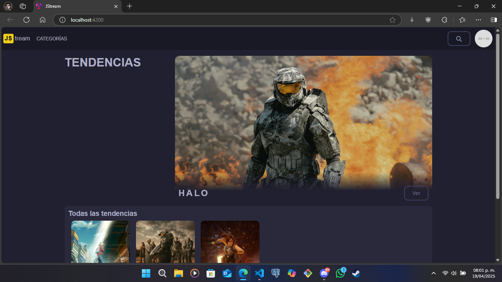

# JStream

JStream es una plataforma web de trasmisión de contenido audiovisual. Es un proyecto en desarrollo en conjunto con el programa del Semillero de desarrolladores MEGA.

## Objectivo.
Migración o implementación de Angular en su versión 18 usando Typescript y concluyendo las funcionalidades pendientes.

## Nombre del desarrollador
Aldo Kalid Hernández Camarena

## Imagen del sistema en funcionamiento.

## ¿Cómo ejecutar el programa?
Aquí te explico cómo ejecutar el programa en un entorno de desarrollo con **ng serve** en un entorno con Visual Studio Code y Windows 10/11 (estos pasos podrían ser diferentes en otros SOs).
1. **Descarga el repositorio.**
Ubícate al tope de esta página y haz clic en el obvio botón verde "<> Code" y, luego, haz clic en "Download ZIP". Esto iniciará (o solicitará, depende de tu navegador) la descarga.
2. **Descomprime el repositorio.**
Dirígete a tu carpeta de descargas (o donde sea que lo hayas guardado) y descomprime el archivo. Puedes utilizar la herramienta integrada de Windows para descomprimir archivos ZIP o cualquier otra de tu agrado.
3. **Descarga e instala Visual Studio Code.**
_Si ya tienes Visual Studio Code instalado, salta al siguiente paso_. [Haz clic aquí](https://code.visualstudio.com/) para descargar Visual Studio Code. Una vez descargado, lo instalas.
4. **Descarga e instala Node JS.**
_Si ya tienes Node JS instalado, salta al siguiente paso_. [Haz clic aquí](https://nodejs.org/) para descargar NodeJS (te recomiendo que descargues la versión LTS). Una vez descargado, lo instalas. Puede que no sea necesario, pero te sugiero reinicar tu computadora después de la instalación.
5. **Abre el repositorio en Visual Studio Code.**
Abre Visual Studio Code y, en la parte superior izquierda, haz clic en _Archivo > Abrir carpeta_. Luego, busca la carpeta que descomprimiste en el paso 2 y ábrela (asegúrate que sea la carpeta más directa al repositorio, es decir, **la carpeta en donde se encuentra este mismo archivo**: _README.md_). Esto debería mostrar el repositorio en Visual Studio Code.
6. **Instala Angular JS.**
_Si ya tienes Angular JS instalado, salta al siguiente paso_. [Haz clic aquí](https://angular.dev/installation) para instalar Angular (Node JS ya debe estar instalado). Asegúrate de instalar la versión 18 o superior.
7. **Instala las dependencias.**
En Visual Studio Code, haz la combinación de teclas **Ctrl + Ñ** para abrir una terminal (la tecla _Ñ_ se ubica a la derecha de la tecla _L_ en un teclado QWERTY latinoamericano). También puedes abrirla desde la opción _Terminal_ en la barra superior izquierda de opciones o puedes optar por abrir una consola externa a Visual Studio Code, solo asegúrate de ubicarte en la carpeta raiz del repertorio. En la terminal, ejecuta el comando ***npm i***, esto instalará todas las depedendencias del proyecto.
8. **Ejecuta el programa.**
Para ejecutar el programa únicamente en tu computadora, utiliza el script **ng serve**. Para ejecutar el programa en un servidor local (para acceder desde tu PC u otro dispositvo), utiliza el script **npm start**.
Ya que Angular haya "construido" el proyecto, te mostrará la dirección o direcciones para acceder desde el navegador. Deja pulsado _Ctrl_ y haz clic izquierdo sobre una de ellas. Esto abrirá tu navegador con la página del proyecto.

## Dependencias del proyecto.
Todas las dependencias listadas fueron obtenidas del archivo _package.json_. Todas fueron instaladas por Angular 18.

### dependencies.
- "@angular/animations": "^18.2.0",
- "@angular/common": "^18.2.0",
- "@angular/compiler": "^18.2.0",
- "@angular/core": "^18.2.0",
- "@angular/forms": "^18.2.0",
- "@angular/platform-browser": "^18.2.0",
- "@angular/platform-browser-dynamic": "^18.2.0",
- "@angular/platform-server": "^18.2.0",
- "@angular/router": "^18.2.0",
- "@angular/ssr": "^18.2.18",
- "express": "^4.18.2",
- "rxjs": "~7.8.0",
- "tslib": "^2.3.0",
- "zone.js": "~0.14.10"

### devDependencies.
- "@angular-devkit/build-angular": "^18.2.18",
- "@angular/cli": "^18.2.18",
- "@angular/compiler-cli": "^18.2.0",
- "@types/express": "^4.17.17",
- "@types/jasmine": "~5.1.0",
- "@types/node": "^18.18.0",
- "jasmine-core": "~5.2.0",
- "karma": "~6.4.0",
- "karma-chrome-launcher": "~3.2.0",
- "karma-coverage": "~2.2.0",
- "karma-jasmine": "~5.1.0",
- "karma-jasmine-html-reporter": "~2.1.0",
- "typescript": "~5.5.2"

## ¿Cómo lo hice?
Primero realicé una copia del código legado a una nueva rama en GitHub (la rama es 'legacy-sprint-1'). Luego moví el contenido del repertorio legado a una carpeta copia. Después creé un nuevo proyecto de Angular dentro de la carpeta raiz del repositorio con el script **ng new jstream --routing** (un proyecto Moduless). Una vez creado, moví todo el contenido de la carpeta del proyecto de Angular a la carpeta raíz del repertorio y borre la carpeta del proyecto de Angular. Hice esto para mantener la configuarción de Git y poder seguir haciendo los commits y pushes.

De acuerdo con las páginas HTML y scripts que tenía en el código legado, fui creando los componentes necesarios para replicar el proyecto con el script **ng g c** en _./src/app/core_ y _./src/app/shared/components_.

En el caso de componentes que se actualizan en un intervalo de tiempo (_carousel-component_), no es posible utilizar setTimeout ni setInterval sin hacer actualizaciones a la página innesesarias o que la página se quede cargando. Esta era la solución que utilicé en el Sprint 1. Aquí utilicé NgZone para ejecutar código fuera del entorno de Angular (para evitar hacer cargas innecesarias), setInterval para iniciar los intervalos y el evento _(animationend)_ para eliminar los componentes viejos.

Para el enrutamiento, hice un archivo de rutas adicional para _HomeComponent_ (donde se renderizan el resto de páginas), esto para que el componente _NavbarComponent_ (renderizando en _AppComponent_, el componente padre de todos los componentes) esté estático y no tenga que volver a definirse en cada otro componente. Esto soluciona en parte el problema de repetición de código que tenía el Sprint anterior. La otra parte del problema lo solucioné con servicios (creados con el script **ng g s** en _./src/app/shared/services_), de los cuales, uno de esos servicios sirve para obtener las películas y series del banco de datos (en _./src/app/data/movies.json_). Solo bastó con inyectar el servicio en cada uno de los componentes que lo requirieron.

Adicionalmente, agregué una ruta para buscar películas y series con coincidencias en el título y trabajé la ruta 404 para cualquier ruta no esperada.

Finalmente, para que Angular pudiera detectar imágenes e íconos guardados en este repo, agregué la ubicación de los recursos src/assets/_ al archivo _angular.json_ en los parámetros **assets**.

## Problemas conocidos.
1. El proyecto tiene vulnerabilidades moderadas (mostrado después de instalar las dependencias). No se puede arreglar porque esto implica actualizar las dependencias de Angular a la versión 19. Utilizar Angular 19 incumple el objetivo definido por el Challenger.
2. El componente _session-popup.component_ (el que aparece al hacer clic sobre la imagen del usuario después de haber iniciado sesión) desaparece del DOM cuando se hace clic fuera del componente excepto cuando el clic se hace sobre el _Navbar_. Esto último es un comportamiento no deseado. 
4. En ocaciones, la consola del navegador puede arrojar errores relacionados al renderizado de imágenes, indicando que son muy grandes y que deberían tener la propiedad "priority". Al hacer esto, la consola pide que el las imágenes con la propiedad "priority" sean definidas en el index.html con una etiqueta link (precargado de la imagen). Esto no lo puedo hacer porque el proyecto utiliza imágenes locales en elementos _img_ dinámicos.
5. Si bien el login es simulado, la sesión se "cerrará" al actualizar la página.

## Retrospectiva
### ¿Qué hice bien?
La migración, para este caso, no estuvo del todo complicada. Lo que más me ayudó fueron los servicios, con ellos pude elminiar la redundancia de código que tenía el Sprint 1.

### ¿Qué no salió bien?
No es que saliera mal, sino que no salió lo suficientemente bien. Para el caso de Inicio de Sesión, necesitaba poder comunicar componentes hermanos (el componente Home importa varios componentes. Estos son componentes hermanos) para que las animaciones funcionaran bien. Me tomó demasiado tiempo encontrar una forma de poder realizar esto, y la única forma que encontré fue implementar un modelo que llamé _CallbackAssignerObject_ (en _.src/app/models/callback-assigner.model.ts_).

Básicamente es la instancia de un objeto que tiene un atributo _executer_ como una función. Este objeto se pasa entre componentes y estos componentes asignan una función a ese atributo para que los otros componentes puedan activar dicha función. Esta función puede tener cualquier funcionalidad relacionada al componente que la asigna. Por ejemplo: hay un caso en el que el popup de login y la pantalla de carga se renderizan al mismo tiempo. El popup de login "simula" el inicio de sesión y, al completarse (_onResolve_), el popup le comunica al componete padre (Home) que el usuario ha iniciado sesión y prosigue a cerrarse (con una animación) y a eliminarse del DOM. Pero el componente Home no sabe cómo decirle a la pantalla de carga que debe cerrarse, lo único que puede hacer es quitarlo del DOM en seco.

Para esto, el componente Home crea una instancia de _CallbackAssignerObject_ en sí mismo y se lo pasa a la pantalla de carga cuando esta se va a renderizar. La pantalla de carga asigna una función en _executer_, que lo que hace es cerrar la misma pantalal de carga con las animaciones esperadas. Así, cuando el popup de login avisa al componente Home que ha terminado (_onResolve_), el componente Home activa el _executer_ del _CalbackAssignerObject_ para avisarle a la pantalla de carga que debe cerrarse.

Es una solución que suelo hacer en proyectos de React JS (solo que allí es más limpio), pero no me ha terminado de convencer del todo en Angular. Es lo único que se me ha venido a la mente. Espero cambiarla en el futuro.

### ¿Qué puedo hacer diferente?
"Reiniciar el compilador más seguido". No sé si este sea un problema único desde mi lado, pero me ha pasado, en muchísimas ocaciones, que el "building" no se refleja en el navegador. Por más cambios que haga y por más sentido de funcionamiento cumpla el código, el navegador no lo refleja, no lo entiende. Pasé horas de, **y cito**, "histeria, dolor y sufrimiento", trantando de averiguar porqué sucedía. Sucede que, en todos los casos, había que cerrar el servidor y volver a ejecutar el script **ng serve**. Como por arte de magia, el navegador ya entendía el código de la forma esperada.

No sé porqué sucede esto. Y aunque no es un problema directo mío o de mi código, me resta muchísmo tiempo averiguar errores de este tipo. "Reiniciar el compilador" debería ahorrarme el tiempo (y el dolor de cabeza) en el futuro.
