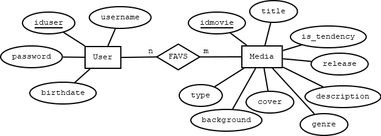
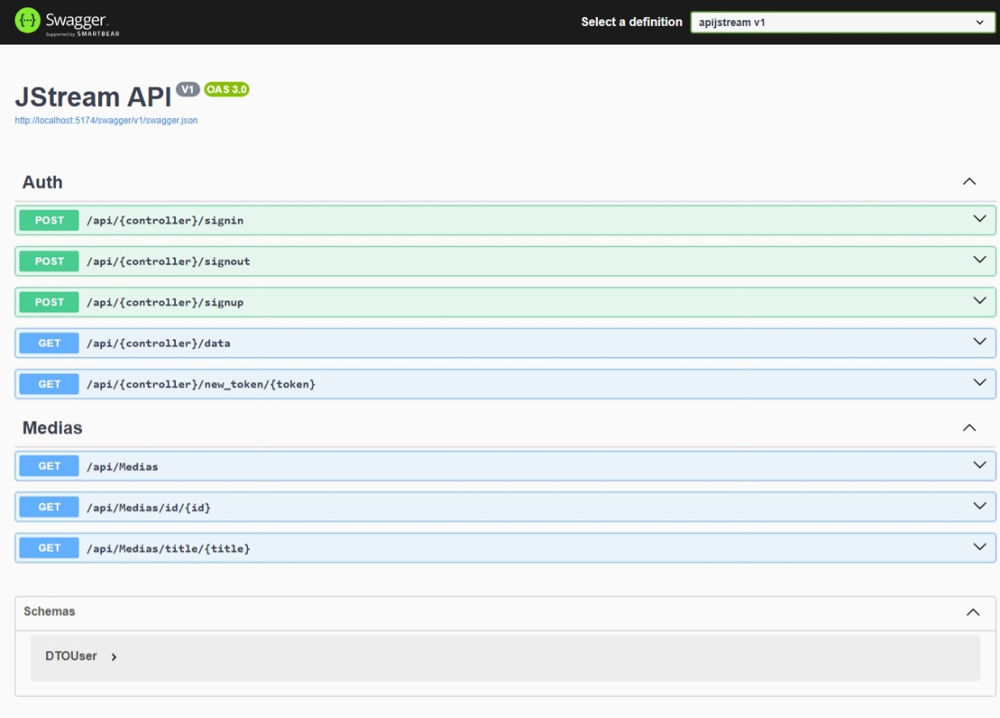

# JStream

JStream es una plataforma web de trasmisión de contenido audiovisual. Es un proyecto en desarrollo en conjunto con el programa del Semillero de desarrolladores MEGA.


## Objetivos.
Los objetivos no fueron especificados para este Sprint, pero se estiman de las tareas:
- Implementar la API en ASP.NET o NET Core (MVC).
- Conectar la API con AngularJS.
- Implementar LogIn con Backend.
- Implementación de CORS.
- El proyecto entero debe estar en un solo repo.
- Documentar la API con Swagger.
- Realizar mejoras a consideración propia.


## Nombre del desarrollador.
Aldo Kalid Hernández Camarena


## Imágenes de la idea principal (MOCKUP).


## Imágenes del sistema en funcionamiento.


## ¿Cómo ejecutar el programa?
Aquí te explico cómo ejecutar el programa con el script **ng serve** y **dotnet run** en un entorno con Visual Studio Code y Windows 10/11 (estos pasos podrían ser diferentes en otros SOs).

1. **Descarga el repositorio.**
Ubícate al tope de esta página y haz clic en el obvio botón verde "<> Code" y, luego, haz clic en "Download ZIP". Esto iniciará (o solicitará, depende de tu navegador) la descarga.

2. **Descomprime el repositorio.**
Dirígete a tu carpeta de descargas (o donde sea que lo hayas guardado) y descomprime el archivo. Puedes utilizar la herramienta integrada de Windows para descomprimir archivos ZIP o cualquier otra de tu agrado.

3. **Descarga e instala Visual Studio Code.**
_Si ya tienes Visual Studio Code instalado, salta al siguiente paso_. [Haz clic aquí](https://code.visualstudio.com/) para descargar Visual Studio Code. Una vez descargado, lo instalas.

4. **Descarga extensiones requeridas de Visual Studio Code.**
  - [NET Install Tool](https://marketplace.visualstudio.com/items?itemName=ms-dotnettools.vscode-dotnet-runtime)
  - [C# support](https://marketplace.visualstudio.com/items?itemName=ms-dotnettools.csharp)
  - [C# Dev Kit](https://marketplace.visualstudio.com/items?itemName=ms-dotnettools.csdevkit)

5. **Descarga e instala Node JS.**
_Si ya tienes Node JS instalado, salta al siguiente paso_. [Haz clic aquí](https://nodejs.org/) para descargar NodeJS (te recomiendo que descargues la versión LTS). Una vez descargado, lo instalas. Puede que no sea necesario, pero te sugiero reinicar tu computadora después de la instalación.

6. **Descarga e instala .NET 9**
_Si ya tienes .NET instalado, salta al siguiente paso_. [Haz clic aquí](https://dotnet.microsoft.com/es-es/download) para descargar .NET 9. Una vez descargado, lo instalas. Puede que no sea necesario, pero te sugiero reinicar tu computadora después de la instalación.

7. **Descarga e instala Microsoft SQL Server**
_Si ya lo tienes instalado, salta al siguiente paso_. [Haz clic aquí](https://www.microsoft.com/es-mx/sql-server/sql-server-downloads) Y descarga la versión Developer. Una vez descargado, lo instalas (instalación básica). Puede que no sea necesario, pero te sugiero reinicar tu computadora después de la instalación.

8. **Descarga e instala SQL Server Management Studio**
_Si ya lo tienes instalado, salta al siguiente paso_. [Haz clic aquí](https://learn.microsoft.com/es-es/ssms/install/install) para descargar e instalar (instalación básica) SSMS.

9. **PREPARA LA BASE DE DATOS Y LAS CREDENCIALES**
  Ejecuta SSMS. Si tienes problemas para abrirlo, considera marcar la casilla _Trust server certificate_ y, de ser necesario, ejecutar el programa como administrador. También puedes probar con dejar _Encryption_ en _Optional_.

  Del lado izquierdo, tendrás el _Object Explorer_. En el árbol, ubícate en _Databases_, haz clic derecho sobre él y, luego, clic izquierdo en _Restore Database..._. En la sección _Source_, selecciona _Device:_ y haz clic en el botón _..._ Eso abrirá otra ventana, deberás hacer clic en el botón _Add_ y seleccionar el archivo de la base de datos ubicado en este repertorio: _server/databases/**jstream.bak**_. Haz clic en _Ok_ y la base de datos estará restaurada.

  La autenticación en la API se hace por SQL, por lo que necesitarás habilitar la autenticación SQL de tu servidor y un **LOGIN**.

  Para habilitar la autenticación SQL, diríjete al _Object Explorer_ de SSMS, haz clic derecho en tu servidor (la parte más alta del árbol) y, luego, haz clic en _Properties_. Se abrirá una nueva ventana. De la sección _Select a page_, haz clic en la opción _Securitiy_ y, en la sección _Server authentication_ (la primera), selecciona _SQL Server and Windows Authenticacion Mode_. Finalmente, haz clic en el botón _OK_, cierra SSMS y reinicia el servicio (para reiniciarlo, abre el menú de windows con el botón de Windows del teclado, busca el programa _Servicios_ y ejecútalo como administrador, busca el servicio _SQL Server (MSSQLSERVER)_, haz clic derecho sobre el y, finalmente, haz clic en _Reiniciar_).

  Para crear el **LOGIN**, ejecuta el siguiente bloque en un query (en SSMS) haciento clic en la opción _New Query_ de la barra superior:

  ```SQL
  CREATE LOGIN tuusuario
  WITH PASSWORD = 'tucontraseña'
  GO
  ```
  Luego, crea el usuario:
  ```SQL
  USE jstream
  GO
  CREATE USER jstreamer FOR LOGIN jstreamer
  GO
  ```

  Y, finalmente, dale los permisos:

  ```SQL
  USE jstream;
  GO
  EXEC sp_addrolemember 'db_owner', 'jstreamer'
  GO
  ```

  _Ojo_: Este último bloque lo considero como una vulnerabilidad, y debe ser corregida en el futuro.

10. **Abre el repositorio en Visual Studio Code.**
  Abre Visual Studio Code y, en la parte superior izquierda, haz clic en _Archivo > Abrir carpeta_. Luego, busca la carpeta que descomprimiste en el paso 2 y ábrela (asegúrate que sea la carpeta más directa al repositorio, es decir, **la carpeta en donde se encuentra este mismo archivo**: _README.md_). Esto debería mostrar el repositorio en Visual Studio Code.

11. **Instala Angular JS.**
  _Si ya tienes Angular JS instalado, salta al siguiente paso_. [Haz clic aquí](https://angular.dev/installation) para instalar Angular (Node JS ya debe estar instalado). Asegúrate de instalar la versión 18 o superior.

12. **Instala las dependencias.**
  En Visual Studio Code, haz la combinación de teclas **Ctrl + Ñ** para abrir una terminal (la tecla _Ñ_ se ubica a la derecha de la tecla _L_ en un teclado QWERTY latinoamericano). También puedes abrirla desde la opción _Terminal_ en la barra superior izquierda de opciones o puedes optar por abrir una consola externa a Visual Studio Code, solo asegúrate de ubicarte en la carpeta raiz del repertorio. En la terminal, ejecuta el comando ***npm run install-all***, esto instalará todas las depedendencias de Angular (el cliente) y .NET (el servidor).

13. **Prepara los entornos.**
  Antes de ejecutar nada, debes preparar los entornos (environments) tanto del cliente como del servidor para que el proyecto pueda ejecutarse:
- _Cliente_

    Crea el archivo _client/src/app/environments/environment.ts_ con la siguiente estructura:

    ```typescript
    export const environment = {
      /** Bandera de producción. */
      PRODUCTION: false,
      /** Nombre del servidor. */
      SERVER_NAME: 'tuservidor',
      /** Puerto */
      PORT: 'tupuerto'
    }

    // Evita que el objeto sea modificado.
    Object.freeze(environment);
    ```
    La propiedad **SERVER_NAME** es el dominio donde se ubica tu API. Si es de acceso local, utiliza solo **localhost** (evita usar _http/https_). **PORT** es el puerto por donde escucha tu API. Prueba con ejecutar el server como se indica en el **Paso 10** para averiguar el puerto que utiliza tu servidor.

  - _Servidor_
    Crea los archivos _server/appsettings.json_ y _server/appsettings.Development.json_, ambos con la siguiente estructura:

    ```JSON
    {
      "Logging": {
        "LogLevel": {
          "Default": "Information",
          "Microsoft.AspNetCore": "Warning"
        }
      },
      "AllowedHosts": "*",
      "JwtKey": "<tu-llave-secreta-jwt>",
      "ConnectionStrings": {
        "db": "Server=<tu-servidor>;Database=jstream;User Id=<tu-id-de-usuario>;Password=<tu-contraseña>;TrustServerCertificate=true"
      },
      "Cors": {
        "AllowedOrigin": "<el-origen-de-tu-Angular>"
      }
    }
    ```

    **JwtKey** es la llave privada (256 bits) para poder tokenizar los tokens. Puedes generar un token [aquí](https://jwtsecret.com/generate). **db** es la cadena de conexión a la base de datos. Si alojaste la base de datos en un servicio de Azure, puedes reeplazar la cadena por la cadena de conexión que te da Azure. Si es, en cambio, local, puedes colocar el servidor como **Server=.**, solo asegúrate de ingresar las credenciales de usuario correctas.
    **el-origen-de-tu-Angular** es la dirección IP en la que se ejecuta tu programa de Angular (incluyendo puerto).

14. **Ejecuta el programa (ng serve y dotnet run).**
  Necesitarás dos terminales: una para ejecutar el servidor y otra para ejecutar el cliente. En una de ellas (ubicada en la raiz del repertorio), ejecuta el comando **npm run server**. Esto compilará el servidor en el servidor local de tu computadora. En otra terminal (también ubicada en la raiz del repertorio), ejecuta el comando **npm run client** para ejecutar el programa en tu computadora. Si quieres utilizar el programa en algún otro dispositivo de tu red local, utiliza **npm run client-host**. Ya que Angular haya "construido" el proyecto, te mostrará la dirección o direcciones para acceder desde el navegador. Deja pulsado _Ctrl_ y haz clic izquierdo sobre una de ellas. Esto abrirá tu navegador con la página del proyecto.

15. **Ejecuta el entorno de pruebas (ng test --code-coverage).**
  Para ejecutar el entorno de pruebas, abre una terminal ubicada en la raiz del repertorio y utiliza **npm run client-test**. El navegador por defecto es Chrome.


## A TOMAR EN CUENTA.
La creación de usuarios no está disponible, pero puedes entrar con las credenciales:
  - Usuario: admin
  - Contraseña: admin


## Dependencias del proyecto.
Todas las dependencias listadas fueron obtenidas de los archivos _client/package.json_ y _server/apijstream.csproj_. Todas fueron instaladas por Angular 18.


### dependencies (Angular).
- "@angular/animations": "^18.2.0",
- "@angular/common": "^18.2.0",
- "@angular/compiler": "^18.2.0",
- "@angular/core": "^18.2.0",
- "@angular/forms": "^18.2.0",
- "@angular/platform-browser": "^18.2.0",
- "@angular/platform-browser-dynamic": "^18.2.0",
- "@angular/platform-server": "^18.2.0",
- "@angular/router": "^18.2.0",
- "@angular/ssr": "^18.2.18",
- "express": "^4.18.2",
- "rxjs": "~7.8.0",
- "tslib": "^2.3.0",
- "zone.js": "~0.14.10"


### devDependencies (Angular).
- "@angular-devkit/build-angular": "^18.2.18",
- "@angular/cli": "^18.2.18",
- "@angular/compiler-cli": "^18.2.0",
- "@types/express": "^4.17.17",
- "@types/jasmine": "~5.1.0",
- "@types/node": "^18.18.0",
- "jasmine-core": "~5.2.0",
- "karma": "~6.4.0",
- "karma-chrome-launcher": "~3.2.0",
- "karma-coverage": "~2.2.0",
- "karma-jasmine": "~5.1.0",
- "karma-jasmine-html-reporter": "~2.1.0",
- "typescript": "~5.5.2"


### Packages (NET)
- "Microsoft.AspNetCore.Authentication.JwtBearer" Version="9.0.5"
- "Microsoft.AspNetCore.OpenApi" Version="9.0.4"
- "Microsoft.EntityFrameworkCore.SqlServer" Version="9.0.5"
- "Microsoft.EntityFrameworkCore.Tools" Version="9.0.5"
- "Swashbuckle.AspNetCore" Version="8.1.2"


## ¿Cómo lo hice?
Primero que nada, tuve que modificar la forma en la que la API realiza el consumo. Anteriormente el consumo se hacía desde el Program.cs, en donde se definían los endpoints de consumo para el Cliente. Para cumplir con el objetivo de crear una API MVC, creé las interfaces (para los controladores), repositorios (consumo de la base de datos) y controladores (consumo API).

Se requirió autenticación con tokens, así que implementé un generador de tokens que duran dos horas en sesiones activas y hasta siete días en sesiones a largo plazo. Esto último refiere que la API guarda los tokens generados en un arreglo en **_server/data/UserService.cs_**. Cuando un cliente intenta consumir a un endpoint que requiere autenticación y el servidor lo rechaza (401: no autorizado), el cliente solicita a la API que se le genere un nuevo token. Si el token anterior no ha pasado el límite de siete días, entonces la API genera un nuevo token y lo envía al cliente para que siga haciendo las peticiones. Si no, entonces el servidor rechaza la petición, obligando al cliente autenticarse nuevamente.

Por último, actualicé la forma en la que se hace la autenticación en el cliente. Anteriormente la autenticación almacenaba el nombre de usuario, ahora almacena el token que genera la API. La forma de re-autenticar la sesión cuando se vuelve a acceder a la página (por ejemplo, refrescando el navegador) es enviando el token, cuando anteriormente se hacía enviando el nombre de usuario que era almacenado en un arreglo de nombres de usuario en el servidor (inseguro).

## Reporte de CODE-COVERAGE.


## Reporte de TESTING.


## Modelo ER.



## Mejoras futuras
- Implementar la creación de usuarios.
- Lista de favoritos para usuarios.
- Compatibilidad con Kubernetes.
- Consumo de hipermedia (imágenes) desde la API (algo como Multer con NodeJS).


## Documentaicón de la API - Swagger.



# Archivos de configuración de ambientes, de Docker y de Kubernetes.
Los archivos Dockerfile y YAML (para kubernetes) no se incluyen en este Sprint porque el no conseguí generar una imagen de Doker del cliente ni del servidor.


## Problemas conocidos.
1. El proyecto tiene vulnerabilidades moderadas (mostrado después de instalar las dependencias). No se puede arreglar porque esto implica actualizar las dependencias de Angular a la versión 19. Utilizar Angular 19 incumple el objetivo definido por el Challenger.
2. El componente _session-popup.component_ (el que aparece al hacer clic sobre la imagen del usuario después de haber iniciado sesión) desaparece del DOM cuando se hace clic fuera del componente excepto cuando el clic se hace sobre el _Navbar_. Esto último es un comportamiento no deseado. 
4. En ocaciones, la consola del navegador puede arrojar errores relacionados al renderizado de imágenes, indicando que son muy grandes y que deberían tener la propiedad "priority". Al hacer esto, la consola pide que las imágenes con la propiedad "priority" sean definidas en el index.html con una etiqueta link (precargado de la imagen). Esto no lo puedo hacer porque el proyecto utiliza imágenes locales en elementos _img_ dinámicos.


## Retrospectiva
### ¿Qué hice bien?
Creo que la forma en la que gestiono los tokens agrega una capa de seguridad, permitiendo al servidor volver a generar un token cuando ha caducado sin la necesidad de pedir a cliente sus credenciales y de caducar un token cuando el cliento ha cerrado sesión implícitamente.

### ¿Qué no salió bien?
La API era incapaz de permitir al cliente consumir los endpoints con el decorador **\\[Authorize]**. Intenté muchas formas de intentar solucionar el error, desde intentar corregir posibles malas definiciones de los endpoints, hasta detectar, por consola, si la llave secreta utilizada en _Program.cs_ y en el generador de tokens era el mismo. Nada de esto funciono, hasta que revisé en el _Program.cs_:

``` C#
// ** Middleware: Entre frontend y backend **
// HTTPS redirection.
app.UseHttpsRedirection();
// Cors. Debe ponerse antes de las siguientes dos líneas, si no, cors bloqueará las solicitudes.
app.UseCors("FrontendPolicy");
// Para JWT.
app.UseAuthentication(); // Primero verifica si el usuario tiene un token válido.
app.UseAuthorization(); // Después de lo anterior, decide si el usuario tiene permiso de acceder.
// Controles de Swagger.
app.MapControllers();
```

Pasaba que la línea _app.UseCors_ estaba hasta abajo del todo, y _app.UseAuthentication_ y _app.UseAuthorization_ estaban invertidas. Este "absurdísimo" error rompió mi API entera. Resulta que _app.UseCors_ no puede estar al final porque, de ese modo, todas las peticiones serían bloqueadas. Las otras dos líneas no pueden estar invertidas porque primero debe verificarse la autenticación del usuario (su token), luego el programa decide si autoriza la petición en base a esa autenticación.

### ¿Qué puedo hacer diferente?
Ser más cauteloso con este tipo de errores. Por más absurdos que parezcan, estas cosas tienen una forma correcta de hacerse, y si no se hacen así, el programa no va a funcionar.
