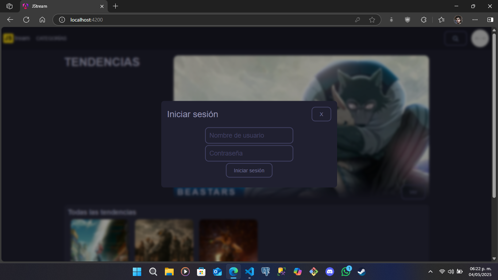
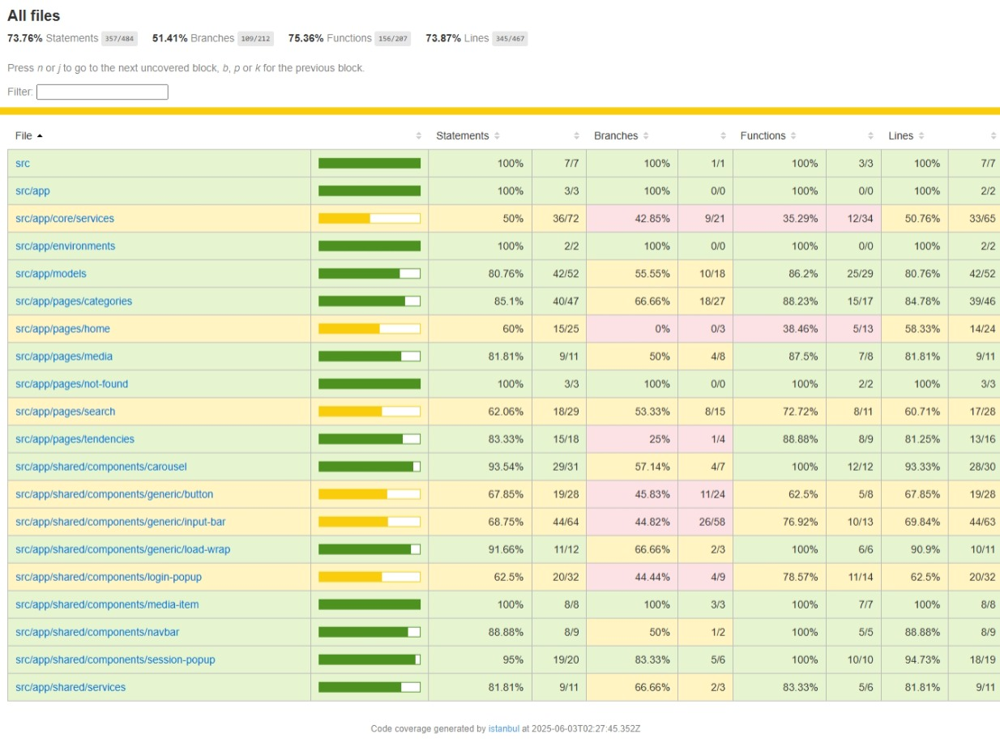
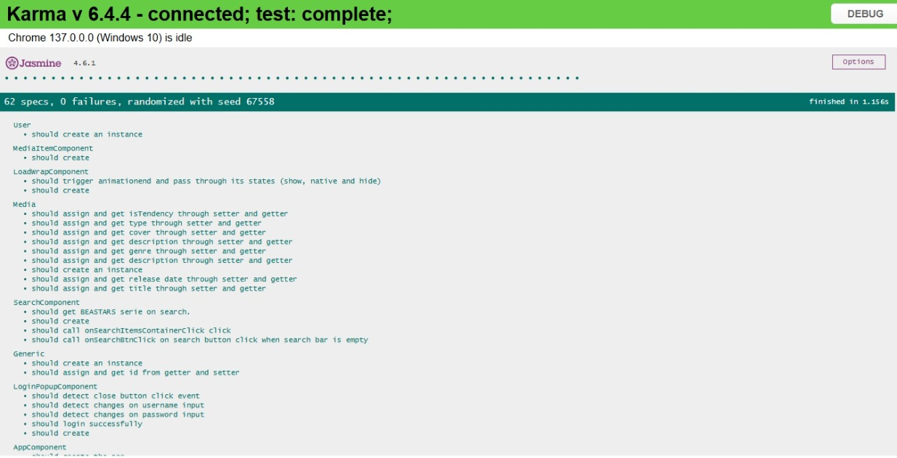

# JStream

JStream es una plataforma web de trasmisión de contenido audiovisual. Es un proyecto en desarrollo en conjunto con el programa del Semillero de desarrolladores MEGA.

## Objetivos.
- Implementación de funcionalidades asíncronas en el proyecto de Angular del Hub de entretenimiento.
- 50% de testing code coverage en el proyecto.

## Nombre del desarrollador
Aldo Kalid Hernández Camarena

## Imágenes del sistema en funcionamiento.

## Imágenes de la idea principal (MOCKUP).

## ¿Cómo ejecutar el programa?
Aquí te explico cómo ejecutar el programa con el script **ng serve** en un entorno con Visual Studio Code y Windows 10/11 (estos pasos podrían ser diferentes en otros SOs).
1. **Descarga el repositorio.**
Ubícate al tope de esta página y haz clic en el obvio botón verde "<> Code" y, luego, haz clic en "Download ZIP". Esto iniciará (o solicitará, depende de tu navegador) la descarga.
2. **Descomprime el repositorio.**
Dirígete a tu carpeta de descargas (o donde sea que lo hayas guardado) y descomprime el archivo. Puedes utilizar la herramienta integrada de Windows para descomprimir archivos ZIP o cualquier otra de tu agrado.
3. **Descarga e instala Visual Studio Code.**
_Si ya tienes Visual Studio Code instalado, salta al siguiente paso_. [Haz clic aquí](https://code.visualstudio.com/) para descargar Visual Studio Code. Una vez descargado, lo instalas.
4. **Descarga e instala Node JS.**
_Si ya tienes Node JS instalado, salta al siguiente paso_. [Haz clic aquí](https://nodejs.org/) para descargar NodeJS (te recomiendo que descargues la versión LTS). Una vez descargado, lo instalas. Puede que no sea necesario, pero te sugiero reinicar tu computadora después de la instalación.
5. **Abre el repositorio en Visual Studio Code.**
Abre Visual Studio Code y, en la parte superior izquierda, haz clic en _Archivo > Abrir carpeta_. Luego, busca la carpeta que descomprimiste en el paso 2 y ábrela (asegúrate que sea la carpeta más directa al repositorio, es decir, **la carpeta en donde se encuentra este mismo archivo**: _README.md_). Esto debería mostrar el repositorio en Visual Studio Code.
6. **Instala Angular JS.**
_Si ya tienes Angular JS instalado, salta al siguiente paso_. [Haz clic aquí](https://angular.dev/installation) para instalar Angular (Node JS ya debe estar instalado). Asegúrate de instalar la versión 18 o superior.
7. **Instala las dependencias.**
En Visual Studio Code, haz la combinación de teclas **Ctrl + Ñ** para abrir una terminal (la tecla _Ñ_ se ubica a la derecha de la tecla _L_ en un teclado QWERTY latinoamericano). También puedes abrirla desde la opción _Terminal_ en la barra superior izquierda de opciones o puedes optar por abrir una consola externa a Visual Studio Code, solo asegúrate de ubicarte en la carpeta raiz del repertorio. En la terminal, ejecuta el comando ***npm i***, esto instalará todas las depedendencias del proyecto.
8. **Ejecuta el programa (ng serve).**
Para ejecutar el programa únicamente en tu computadora, utiliza el script **ng serve**. Para ejecutar el programa en un servidor local (para acceder desde tu PC u otro dispositvo), utiliza el script **npm start**.
Ya que Angular haya "construido" el proyecto, te mostrará la dirección o direcciones para acceder desde el navegador. Deja pulsado _Ctrl_ y haz clic izquierdo sobre una de ellas. Esto abrirá tu navegador con la página del proyecto.
9. **Ejecuta el entorno de pruebas (ng test --code-coverage).**
Para ejecutar el entorno de pruebas, utiliza **ng test --code-coverage**. El navegador por defecto es Chrome.

## Dependencias del proyecto.
Todas las dependencias listadas fueron obtenidas del archivo _package.json_. Todas fueron instaladas por Angular 18.

### dependencies.
- "@angular/animations": "^18.2.0",
- "@angular/common": "^18.2.0",
- "@angular/compiler": "^18.2.0",
- "@angular/core": "^18.2.0",
- "@angular/forms": "^18.2.0",
- "@angular/platform-browser": "^18.2.0",
- "@angular/platform-browser-dynamic": "^18.2.0",
- "@angular/platform-server": "^18.2.0",
- "@angular/router": "^18.2.0",
- "@angular/ssr": "^18.2.18",
- "express": "^4.18.2",
- "rxjs": "~7.8.0",
- "tslib": "^2.3.0",
- "zone.js": "~0.14.10"

### devDependencies.
- "@angular-devkit/build-angular": "^18.2.18",
- "@angular/cli": "^18.2.18",
- "@angular/compiler-cli": "^18.2.0",
- "@types/express": "^4.17.17",
- "@types/jasmine": "~5.1.0",
- "@types/node": "^18.18.0",
- "jasmine-core": "~5.2.0",
- "karma": "~6.4.0",
- "karma-chrome-launcher": "~3.2.0",
- "karma-coverage": "~2.2.0",
- "karma-jasmine": "~5.1.0",
- "karma-jasmine-html-reporter": "~2.1.0",
- "typescript": "~5.5.2"

## ¿Cómo lo hice?
No pude aplicar TDD (Test Driven Development) porque el proyecto "ya estaba hecho". Lo que hice fue realizar las funciones _it_ en los archivos de prueba para cada componente, modelo y servicio, para cada una de sus funciones y/o métodos.

Para cerrar sesión, la página necesita recargar la página. Esto fue una amenaza para el entorno de pruebas, así que reemplacé las partes donde utilizaba _window_ con el servicio BrowserService más un _InjectableToken<Window>_ (InjectableToken es necesario porque window no es una clase y no puede ser inyectado como un servicio o componente de Angular).

Para RXJS, solamente lo apliqué para _DAOCatalogueService_, que es el servicio que se encarga de obtener las películas del banco de datos (local). Este servicio tiene el atributo _catalogue$_ que usa _of_ en "la información cruda" del banco de datos para transformarlos en instancias válidas de _Media_. Los componentes que necesitan de este servicio se suscriben a _catalogue$_, obtienen la lista de películas y la manipulan si así lo requieren, desuscribiéndose del servicio cuando terminaron la operación.

## Problemas conocidos.
1. El proyecto tiene vulnerabilidades moderadas (mostrado después de instalar las dependencias). No se puede arreglar porque esto implica actualizar las dependencias de Angular a la versión 19. Utilizar Angular 19 incumple el objetivo definido por el Challenger.
2. El componente _session-popup.component_ (el que aparece al hacer clic sobre la imagen del usuario después de haber iniciado sesión) desaparece del DOM cuando se hace clic fuera del componente excepto cuando el clic se hace sobre el _Navbar_. Esto último es un comportamiento no deseado. 
4. En ocaciones, la consola del navegador puede arrojar errores relacionados al renderizado de imágenes, indicando que son muy grandes y que deberían tener la propiedad "priority". Al hacer esto, la consola pide que las imágenes con la propiedad "priority" sean definidas en el index.html con una etiqueta link (precargado de la imagen). Esto no lo puedo hacer porque el proyecto utiliza imágenes locales en elementos _img_ dinámicos.
5. Si bien el login es simulado, la sesión se "cerrará" al actualizar la página.

## Reporte de CODE-COVERAGE.

## Reporte de TESTING.

## Retrospectiva
### ¿Qué hice bien?
Pude realizar el alcance del código más allá del 50% (algunos superando el 80%). Para los casos que se mantienen en amarillo podrán ser cubiertos mejor cuando el proyecto implemente conexión con una base de datos o con la API de backend.

### ¿Qué no salió bien?
Fue muy confuso realizar las pruebas unitarias a componentes que utilizan _animationend_ para realizar ciertos eventos. Karma y Jasmine simplemente no detectan estos eventos automáticamente y no hubo manera de hacerlo funcionar (de forma automática). Tuve que activar los eventos de forma manual y escuchar a las funciones ligadas a dichos eventos para verificar si el evento se disparó. Desconozco si realmente haya forma de que Jasmine y Karma detecten por sí solos cuando estos eventos se disparan.

### ¿Qué puedo hacer diferente?
Comprender mejor _RXJS_. Aún me es complicado entender cómo funciona esta librería. Pensaba que usar _RXJS_ era igual a la programación asíncrona, pero _RXJS_ no tiene porqué ser asíncrono, puede funcionar en el hilo principal sin problema. Tal vez debo repasar el tema en el curso de Liderly.

## Notas del desarrollador
Las imágenes del MOCKUP se encuentran en la segunda sección: _Imágenes de la idea principal (MOCKUP)._
